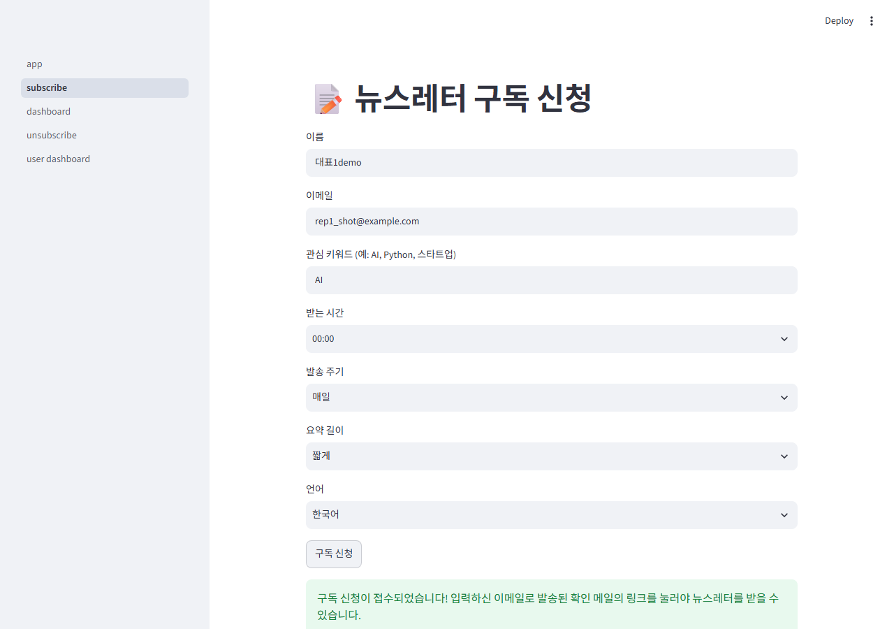
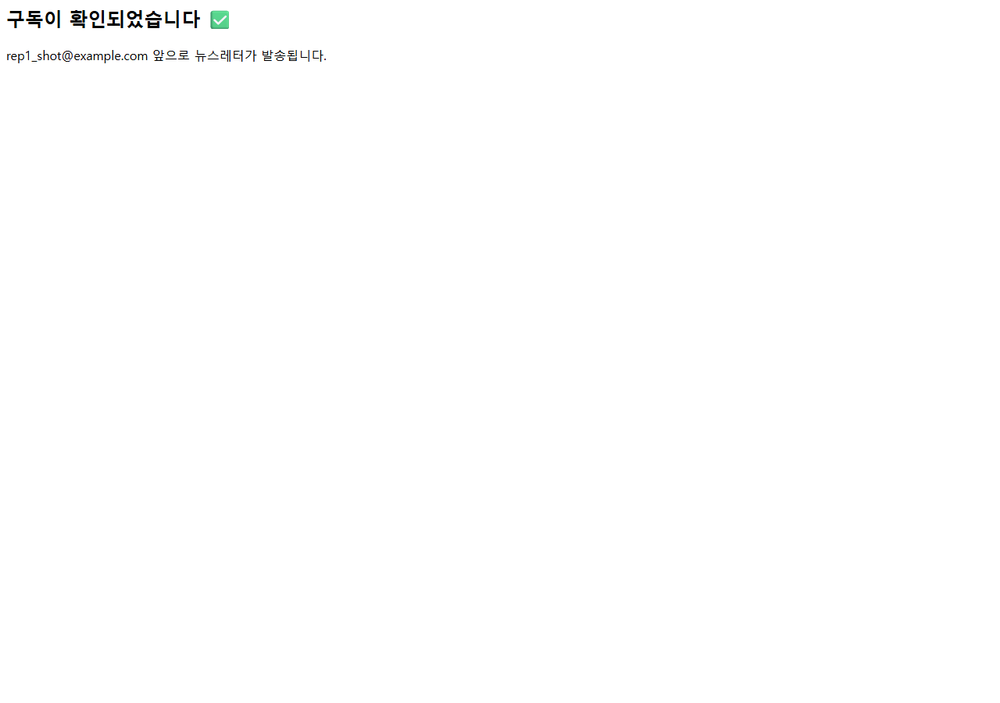
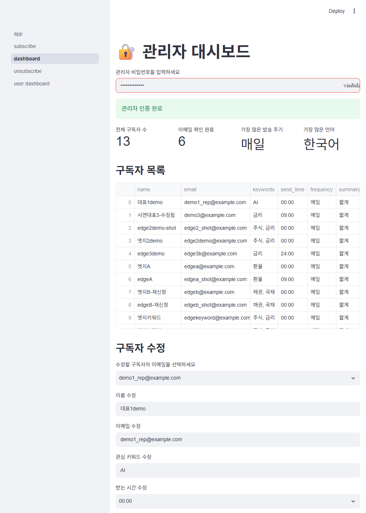
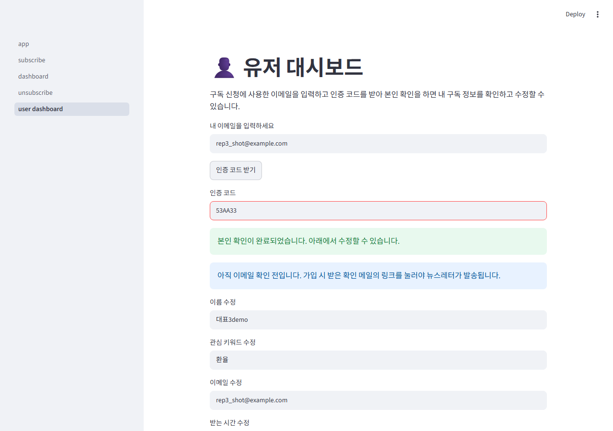
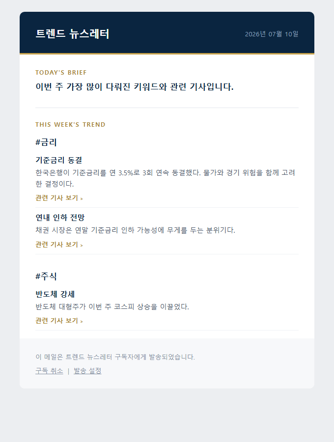
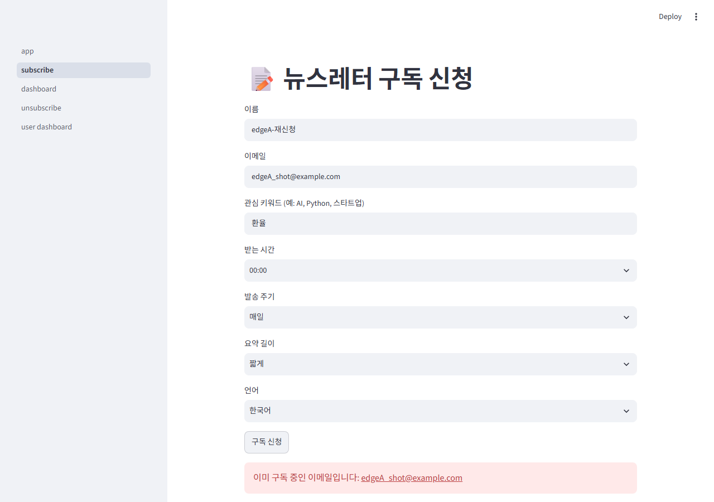
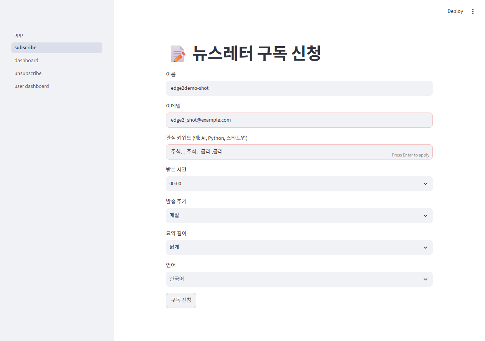
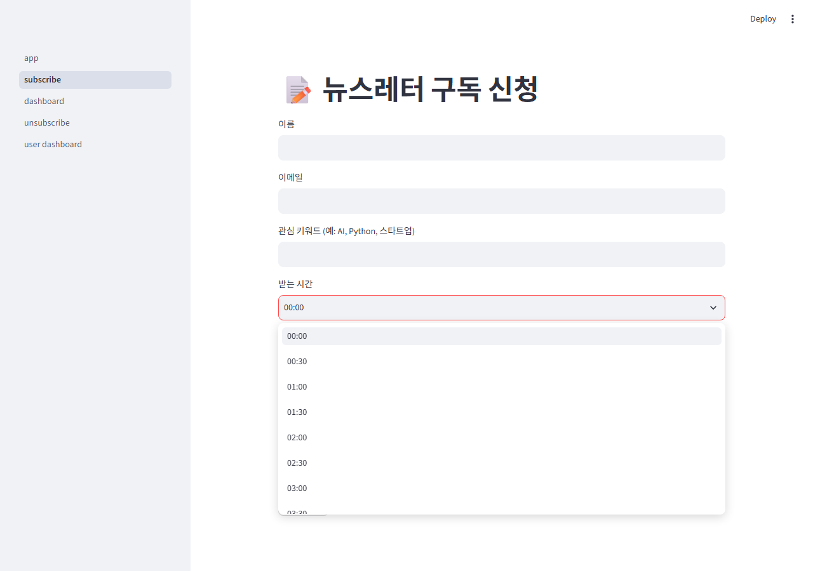
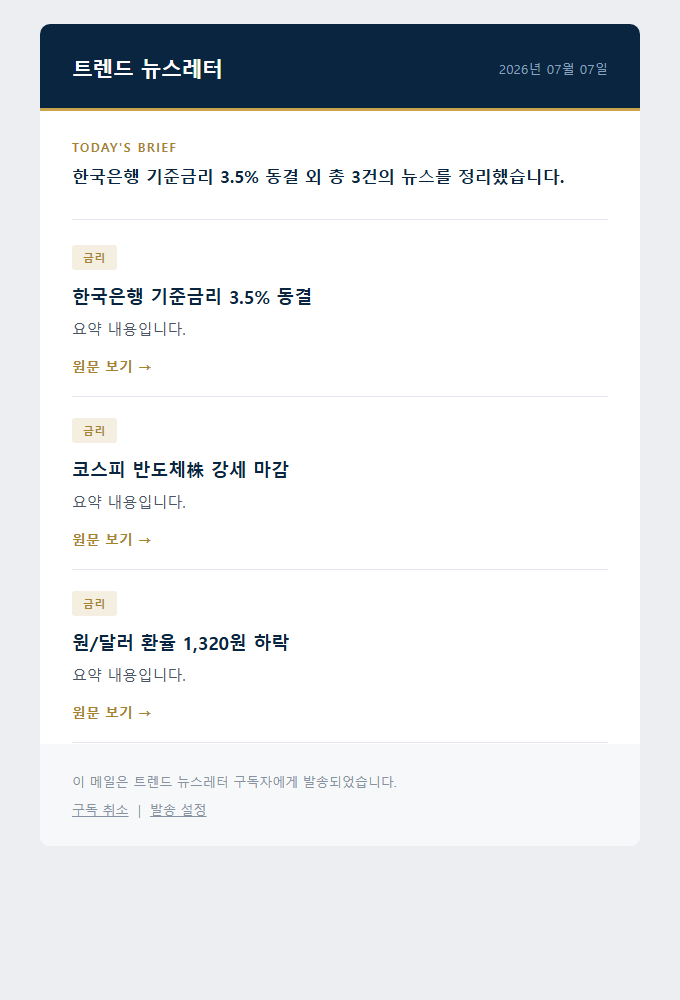
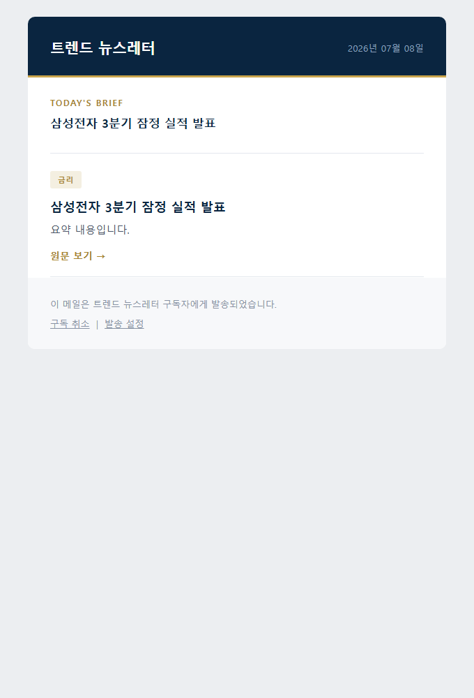

# 발표·시연 런북 (누구나 그대로 따라 하면 됩니다)

발표자가 개발자가 아니어도 위에서 아래로 순서대로 따라 하면 시연이 끝까지 돌아가도록 만든 조작 안내서입니다.
- 회색 박스 안 명령은 **그대로 복사해서 붙여넣기**.
- DB나 코드를 직접 만질 필요 없음 — 필요한 건 `demo_helper.py`(시연 보조 도구)가 대신 처리.
- **무슨 말을 할지(멘트)는 적지 않았습니다.** 각 시연이 "무엇을 보여주는 기능인지"와 "무엇이 화면에 떠야 성공인지"만 있으니, 설명은 발표자 말투로 하세요.

> 상세 검증 기록은 [DEMO_SCENARIOS.md](DEMO_SCENARIOS.md), 빠른 순서표는 [DEMO_PRESENTATION.md](DEMO_PRESENTATION.md).

---

## 준비물 한눈에

| 항목 | 값 |
|---|---|
| 백엔드 주소 | `http://localhost:8000` |
| 프론트(화면) 주소 | `http://localhost:8501` |
| 관리자 비밀번호 | **팀이 이미 설정한 값** (프론트 담당자가 `secrets.toml`에 넣어둔 그 비번 = 백엔드 `.env`의 `ADMIN_PASSWORD`). 발표자는 그 값을 미리 받아두세요. |
| 터미널 창 | **3개**: ①백엔드 ②프론트 ③명령 입력용(헬퍼) |

---

## 0단계. 최초 1회 준비 (발표 전에 미리)

> 한 번만 하면 됩니다. 이미 돌려본 적 있으면 건너뛰어도 됩니다.

**(1) 파이썬 패키지 설치** — 두 폴더 각각:
```
cd team_project
pip install -r requirements.txt
cd ../newsletter_project
pip install -r requirements.txt
```

**(2) 환경설정 확인**
- 관리자 비밀번호는 **이미 설정돼 있습니다**(백엔드 `.env`의 `ADMIN_PASSWORD`, 프론트 담당자의 `secrets.toml` 값과 동일). 새로 만들 필요 없음 — 발표자는 그 비번만 받아두면 됩니다.
- `newsletter_project/.env` 에 이 한 줄만 있으면 됩니다:
  ```
  API_BASE_URL=http://localhost:8000
  ```
- (실제 메일 발송/실시간 뉴스까지 보이려면 `team_project/.env`에 Gmail·NAVER·LLM 키도 필요 — [부록 B](#부록-b-라이브-모드-실제-키-필요-보조자용). 없어도 **데모 모드로 전부 시연 가능**.)

**(3) 잘 되는지 확인**:
```
cd team_project
python demo_helper.py --help
```
사용법이 출력되면 준비 끝.

---

## 1단계. 발표 직전 세팅 (약 3분)

**터미널① — 백엔드** (`team_project` 폴더):
```
python -m uvicorn src.api:app --port 8000
```
`Application startup complete.` 가 뜨면 성공. **이 창은 끄지 말고 그대로.**

**터미널② — 프론트(화면)** (`newsletter_project` 폴더):
```
streamlit run app.py --server.port 8501
```
브라우저가 자동으로 열립니다. 안 열리면 `http://localhost:8501` 직접 입력. **이 창도 그대로.**

**터미널③ — 데모 데이터 초기화** (`team_project` 폴더):
```
python demo_helper.py reset
python demo_helper.py seed
python demo_helper.py list
```
`list`에 데모 구독자 3명(김민준·이서연·박지후)이 보이면 준비 완료.

**프리플라이트 체크리스트** (하나라도 안 되면 아래 [문제 해결](#문제-생기면-troubleshooting)):
- [ ] 브라우저에서 `http://localhost:8501` 이 열린다
- [ ] 왼쪽 메뉴에 subscribe / dashboard / unsubscribe / user dashboard 가 보인다
- [ ] `python demo_helper.py list` 에 구독자 3명이 나온다
- [ ] 관리자 비밀번호(팀 설정값)를 손에 들고 있다

미리 브라우저 탭 3개(`/subscribe`, `/dashboard`, `/user_dashboard`)를 열어두면 매끄럽습니다.

---

## 2단계. 시연 각본 (7개, 스토리 순서)

각 시연: **[보여주는 기능] → [클릭/입력] → [헬퍼 명령] → [성공 화면]**.
헬퍼 명령은 항상 **터미널③**(team_project 폴더)에서.

---

### 시연 1. 신규 구독 → 이메일 확인 (더블 옵트인)

**보여주는 기능**: 가입만으로 끝이 아니라, 이메일 주인임을 확인해야 발송 대상이 된다(스팸·오타 주소 방지).

1. `/subscribe` 로 이동.
2. 이름 `홍길동`, 이메일 `hong@demo.com`, 키워드 `주식, 금리` 입력 → **"구독 신청"** 클릭.
3. **확인 링크 얻기 — 둘 중 하나**:
   - (실제 메일 켰다면) `hong@demo.com` 받은편지함의 "구독 확인" 메일 링크 클릭.
   - (폴백, 항상 됨) 터미널③:
     ```
     python demo_helper.py confirm-url hong@demo.com
     ```
     출력된 주소를 브라우저에 붙여넣고 **"구독 확정하기"** 클릭.
4. **성공 화면**: "구독이 확인되었습니다" 페이지. (`python demo_helper.py list` 로 `hong@demo.com` 이 `[v]`로 바뀐 것도 확인 가능)

> 설계 메모(질문 대비): 확인 링크(GET)를 열어도 **버튼을 눌러야** 확정됩니다 — 메일 보안 프로그램이 링크를 미리 열어봐도 확정되지 않게 한 것.




---

### 시연 2. 관리자 대시보드 — 조회·수정·삭제

**보여주는 기능**: 관리자가 비밀번호 하나로 전체 구독자를 화면에서 관리(백엔드가 단일 인증).

1. `/dashboard` 로 이동.
2. 관리자 비밀번호(팀 설정값) 입력 후 Enter.
3. **성공 화면**: "관리자 인증 완료" + 통계(전체·확인 완료·최다 주기·최다 언어) + 구독자 목록 표.
4. **수정**: "구독자 수정"에서 `minjun@demo.com` 선택 → 이름을 `김민준-수정됨` 으로 바꾸고 **"수정 저장"** → 표에 반영.
5. **삭제**: "구독자 삭제"에서 `seoyeon@demo.com` 선택 → **"선택한 구독자 삭제"** → 목록에서 사라짐.



---

### 시연 3. 셀프서비스 — 본인확인 코드로 내 정보 수정

**보여주는 기능**: 관리자가 아니어도, 이메일로 받은 일회성 코드만으로 본인 정보를 조회·수정(코드 15분 만료).

1. `/user_dashboard` 로 이동.
2. 내 이메일에 `minjun@demo.com` 입력 → **"인증 코드 받기"** 클릭.
3. **코드 얻기 — 둘 중 하나**:
   - (실제 메일 켰다면) 받은편지함 "본인 확인 코드" 메일에서 확인.
   - (폴백, 항상 됨) 터미널③:
     ```
     python demo_helper.py code minjun@demo.com
     ```
     출력된 8자리 코드를 "인증 코드" 칸에 입력.
4. **성공 화면**: "본인 확인이 완료되었습니다" + 수정 폼.
5. 이름을 `김민준(본인수정)` 으로 바꾸고 **"내 정보 수정 저장"** → 저장됨.



---

### 시연 4. 수집 → LLM 요약 → 발송 (핵심 가치사슬)

**보여주는 기능**: 구독자 키워드로 뉴스를 모아 LLM이 이슈→주제로 요약해 **일간 뉴스레터**를 만들고, 그 주 트렌드 키워드와 **관련 기사**를 담은 **별도의 주간 트렌드 메일**을 따로 만든다.

> 기본은 **데모 모드(키 불필요)**. 실시간 뉴스+실제 발송까지 보이려면 [부록 B](#부록-b-라이브-모드-실제-키-필요-보조자용).

1. 터미널③:
   ```
   python demo_helper.py pipeline-demo minjun@demo.com --open
   ```
2. 화면에 `[1/5] 수집 → [2/5] LLM 요약 → [3/5] 일간 렌더 → [4/5] 주간 트렌드 → [5/5] 발송` 5단계가 순서대로 찍힙니다.
3. `--open` 을 붙였으면 **두 개의 HTML**(일간 `newsletter_demo.html` + 주간 `weekly_trend_demo.html`)이 브라우저로 자동으로 열립니다(안 열리면 `demo_output/` 폴더에서 더블클릭).
4. **성공 화면**: (1) 일간 뉴스레터, (2) 별도의 "THIS WEEK'S TREND" 메일 — 키워드(#금리/#주식)마다 토픽·요약·"관련 기사 보기" 링크가 들어 있음.

  

---

### 시연 5. 엣지 — 이미 구독 중인 이메일 재신청

**보여주는 기능**: 겉보기엔 같은 "재가입"도 이메일 확인 여부에 따라 다르게 처리(확인됨=중복 거부 / 미확인=확인 메일 재전송).

1. `/subscribe` 에서 **이미 확인된** 이메일(시연1의 `hong@demo.com` 또는 `minjun@demo.com`)로 다시 신청.
2. **성공 화면**: "이미 구독 중인 이메일입니다" 오류.



---

### 시연 6. 엣지 — 지저분한 키워드 자동 정리

**보여주는 기능**: 공백·중복·빈 값을 섞어 입력해도 저장 시 정리(순서 유지).

1. `/subscribe` 에서 새 이메일(`messy@demo.com`)로, 키워드 칸에 일부러:
   ```
   주식,  , 주식,   금리 ,금리
   ```
2. `/dashboard`(관리자 비번) 또는 터미널③ `python demo_helper.py list` 로 `messy@demo.com` 의 키워드 확인 → **`주식, 금리`** 로 정리됨.



---

### 시연 7. 엣지 — 잘못된 발송시각은 백엔드가 막는다

**보여주는 기능**: 프론트가 원천 차단하고, 우회해도 백엔드가 한 번 더 막는 이중 방어.

1. `/subscribe` 의 **"받는 시간" 드롭다운**을 열어 값이 `00:00, 00:30, 01:00, ...` **30분 단위만** 있음을 보여줌.
2. 터미널③(프론트를 우회해 API를 직접 호출하는 상황):
   ```
   python demo_helper.py bad-time
   ```
3. **성공 화면(터미널 출력)**: `send_minute=15 -> 400`(거부), `send_hour=25 -> 422`(거부), `send_hour=24 -> 201`(자정은 허용, 자동 정리).



---

### 시연 8. ⭐ 차별점 — 같은 기사는 두 번 보내지 않는다 (재발송 방지)

**보여주는 기능**: 시간 없는 직장인을 위해 *매일 새 것만* 보낸다 — 어제 받은 기사는 오늘 메일에서 빠지고, 새 기사가 하나도 없으면 그날은 아예 안 보낸다.

1. 터미널③:
   ```
   python demo_helper.py norepeat-demo minjun@demo.com --open
   ```
2. 같은 구독자에게 3일 연속 발송을 재현하며, 1일차·2일차 메일 HTML 2개가 브라우저로 열립니다(안 열리면 `demo_output/norepeat_day1.html`·`norepeat_day2.html` 더블클릭).
3. **성공 화면**:
   - **1일차** 메일: 뉴스 **3건** 모두 포함.
   - **2일차** 메일: 어제 3건 + 오늘 새 1건인데 → **새 기사 1건만** (어제 본 3건은 빠짐).
   - **3일차**: 새 기사 없음 → 터미널에 `발송 안 함(스킵)`.
4. 두 HTML을 나란히 두면 "어제 3건 → 오늘 새 1건만"이 한눈에 보입니다.

  
  

---

## 마무리

발표 후 데모 데이터 원상복구:
```
python demo_helper.py reset
```
백엔드·프론트 터미널은 `Ctrl + C` 로 종료.

---

## 문제 생기면 (troubleshooting)

| 증상 | 원인 | 해결 |
|---|---|---|
| 화면(8501)이 안 열림 | 프론트 안 켜짐 | 터미널②에서 `streamlit run app.py --server.port 8501` 다시 실행 |
| 관리자 비번 맞는데 "인증 실패" | 백엔드가 다른 `.env`를 봄/안 켜짐 | 백엔드가 `team_project` 폴더에서 켜졌는지 확인 후 재시작(Ctrl+C → 다시 실행) |
| 화면에서 버튼 눌러도 반응 없음/오류 | 백엔드 안 켜짐 | 터미널①에서 `uvicorn ... --port 8000` 다시 실행 |
| `demo_helper.py` 가 "API에 연결 못함" | 백엔드 필요한 명령(`bad-time`)인데 백엔드 꺼짐 | 백엔드부터 켜기 |
| 확인 링크/코드 메일이 안 옴 | 메일 키 미설정(정상) | 헬퍼 폴백: `confirm-url` / `code` 명령 |
| `pipeline-live` 오류 | NAVER/LLM/SMTP 키 없음 | 데모 모드 `pipeline-demo` 사용 또는 [부록 B](#부록-b-라이브-모드-실제-키-필요-보조자용) |
| 목록이 뒤죽박죽/이전 데이터 섞임 | 초기화 안 함 | `python demo_helper.py reset` 후 `seed` |

---

## 부록 A. 시연 보조 도구(`demo_helper.py`) 명령 요약

터미널③(`team_project` 폴더)에서:

| 명령 | 하는 일 |
|---|---|
| `python demo_helper.py reset` | 구독자 전부 삭제(데모 초기화) |
| `python demo_helper.py seed` | 데모 구독자 3명 넣기 |
| `python demo_helper.py list` | 현재 구독자 목록 표로 보기 |
| `python demo_helper.py confirm-url <이메일>` | 확인 링크 출력(메일 대신) |
| `python demo_helper.py code <이메일>` | 본인확인 코드 출력(메일 대신) |
| `python demo_helper.py bad-time` | 발송시각 검증 시연(백엔드 필요) |
| `python demo_helper.py pipeline-demo <이메일>` | 수집→요약→렌더 (내장 샘플, 키 불필요) |
| `python demo_helper.py norepeat-demo <이메일>` | 재발송 방지 시연: 이틀 발송 → 둘째날 새 기사만 (키 불필요) |
| `python demo_helper.py pipeline-live <이메일>` | 실제 수집+LLM+발송 (키 필요) |

## 부록 B. 라이브 모드 (실제 키 필요, 보조자용)

실제 뉴스 수집·LLM 요약·메일 발송까지 라이브로 보이려면 `team_project/.env` 에 아래가 모두 있어야 합니다:
`SENDER`, `GOOGLE_APP_PASSWORD`, `NAVER_CLIENT_ID`, `NAVER_CLIENT_SECRET`, 그리고 LLM 키.

준비되면 **확인 완료된** 구독자를 대상으로:
```
python demo_helper.py pipeline-live minjun@demo.com
```
실제 네트워크 응답에 따라 수십 초 걸릴 수 있고, 대상 이메일 수신함에 실제 뉴스레터가 도착합니다.
키가 하나라도 없으면 실패하므로, **불안하면 기본 데모 모드(`pipeline-demo`)** 를 쓰세요.
