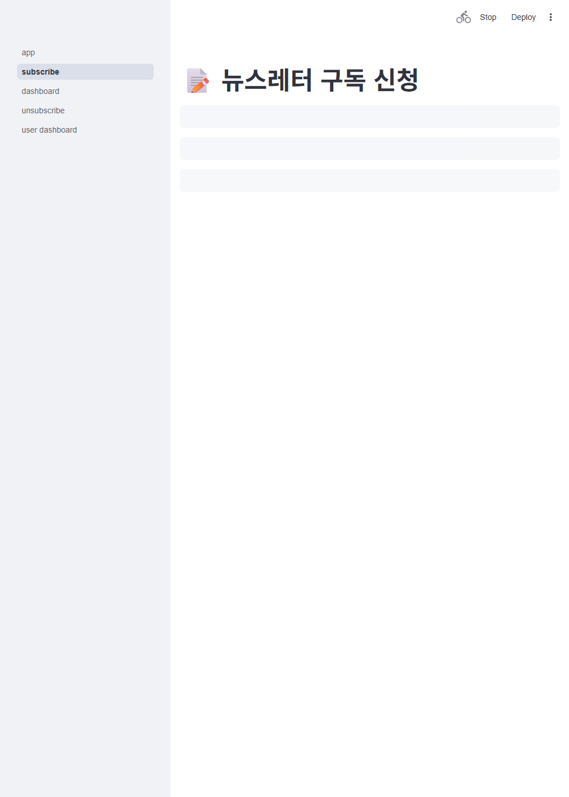

# 동적 검증 결과 (통합 프론트+백+LLM)

병합 코드에 대해 **시나리오를 설계 → 실제 실행**해서 값 수준으로 관측한 기록.
서브시스템별 병렬 설계(멀티에이전트)로 **85개 시나리오**를 뽑고, 실행 가능한 것들을
네 종류의 하네스로 돌려 관측했다. (설계 매트릭스 원본: `_scen_matrix.txt` / `_scen.json`)

## 실행 하네스와 커버리지

| 하네스 | 계층 | 실행 수단 | 파일 |
|---|---|---|---|
| 백엔드 동적 | API·DB·파이프라인·LLM격리·렌더·SMTP | pytest(TestClient/직접호출/스레드/서브프로세스) | `tests/test_dynamic_verification.py` |
| 프론트 로직 | utils 계약 | pytest + 가짜 백엔드(requests 몽키패치) | `../newsletter_project/tests/test_utils_smoke.py` |
| 실 LLM E2E | 요약·QA 2에이전트 | 실제 api.openai.com 호출(gpt-4o-mini) | 스크립트(테스트키 몽키패치, 파일 미수정) |
| 프론트↔백 라이브 | Streamlit 페이지 | 실 uvicorn(8000) + 실 Streamlit + 브라우저 | 스크린샷(아래) |

기존 정규 테스트가 이미 덮는 시나리오(인증 매트릭스·확인 흐름·rate limit 회귀 등)는
중복 구현하지 않고, **새로 추가 가치가 있는 회귀 증명·경계·동시성·격리**를 위 하네스로 실행했다.

---

## 1. 백엔드 동적 — 관측 결과

**API(TestClient)**
- 대문자 이메일 → 소문자로 저장되고 경로 조회도 같은 레코드(정규화).
- 대소문자만 다른 재신청(확인 후) → 409, 별도 행 안 생김.
- `user+tag@x.com` 을 raw `+` 와 `%2B` 두 경로로 조회 → 둘 다 같은 레코드 200.
- `send_hour` 0=201 / 25·-1=422, `send_minute` 60·-1=400, 시각 한쪽만 오면 400, 잘못된 이메일·빈 이메일=400.
- 키워드 공백·빈값만 → `[]` 저장. PUT 최소 본문 → name/keywords 비워지되 `confirmed` 유지.
- **POST /confirm 은 폼 바디만**: 폼=200(확정), JSON=422 (python-multipart 회귀 증명).
- 오답 코드로 **DELETE 11회 → 11번째 429**, 피해자 DB 잔존(파괴적 브루트포스 차단).
- 본인확인 코드 = **8자리 대문자 hex**(32비트) — 예전 6자리 회귀 감지.

**DB(직접 호출)**
- `claim_dispatch` **동시 2스레드 → 정확히 1회만 True**(원자적 선점). 창 안 재시도=False, 창 밖=재선점, 없는 이메일=False.
- `get_top_topics`: 같은 KST 하루 여러 스냅샷=1일, **등장일 수가 스냅샷 수를 이김**, 동률 시 총등장수→이름 순, since 이전 제외, limit/기본 TREND_TOP_N.
- `save_digest`: 보존창(8일) 안은 유지, 밖은 정리 + **FK CASCADE로 하위 이슈 삭제**. `prune_old_digests` 조합 무관 오래된 것만 삭제.
- 추가 인덱스 3종(`idx_digest_issues_digest`/`idx_digest_topics_issue`/`idx_digests_created_at`) 존재.
- `init_db` 재실행이 대소문자 중복 행을 **확인된 쪽으로 병합**(멱등 마이그레이션).

**파이프라인(mock)**
- collect→summarize→dispatch 3잡이 DB를 통해 값으로 이어짐(기사 저장→다이제스트→발송).
- 요약은 구독자 수가 아니라 **(키워드,길이,언어) 조합 수**만큼만 호출.
- 같은 슬롯 재실행 → **메일 정확히 1통**(원자적 claim).
- `is_weekly_anchor` = 발송일 중 가장 이른 요일만 True; 요일 규칙을 바꾸면 앵커가 따라 이동(하드코딩 아님).
- 트렌드 집계는 캐시로 **키워드당 1회**만 조회(구독자 간 공유). 앵커 요일에만 일간과 **별도의 주간 트렌드 메일**(관련 기사 포함)이 나가고, 비앵커일엔 일간만 나감.

**LLM 격리**
- QA가 빈 응답(TypeError) 1건이어도 예외 전파 없이 **그 쿼리는 초안으로 살아남고 나머지 쿼리도 정상**.
- 주입된 client 존중(재생성·키요구 없음), 없고 키 없으면 호출 시에만 RuntimeError.
- 키 없이도 `LLM_fn`·`summarizer`·`pipeline` **import 성공**(별도 서브프로세스로 확인).

**렌더/이메일**
- 카드 제목=topic, 링크=links[0](나머지 링크 미노출). 요약에 `{{원문_링크}}` 리터럴이 있어도 URL로 안 덮임(단일패스).
- `<script>`·카테고리 태그 HTML 이스케이프, `javascript:` href → `#`, 속성탈출 문자열 무력화.
- 주간 트렌드 별도 메일(`render_weekly_trend`): 순위 순서 + 토픽 요약 + **관련 기사 링크**, 등장일 건수 미노출, 다크모드 클래스(text-title/text-body/link-gold) 부착, 트렌드 없으면 빈 문자열(미발송). 일간 뉴스레터엔 트렌드가 안 들어감(완전 분리).
- `send_email` 이 `SMTP_SSL(..., timeout=SMTP_TIMEOUT)` 로 호출(무응답 무한대기 방지).

## 2. 프론트 로직 — 관측 결과 (가짜 백엔드)

- 특수문자 이메일이 경로에서 `%2B/%23/%40` 로 인코딩. 401/403/404=`(None,None)` 코드오류, 500/연결실패=`(None,메시지)` 서버오류로 **구분**.
- delete 3분기: 204→성공 / 404→코드오류 / 500→서버오류 메시지.
- 대소문자만 다른 이메일 변경 → **PUT 1회만**(재가입 아님). 실제 변경 → POST(공개가입)→DELETE 순서.
- 옛 주소 삭제 실패를 **성공으로 위장하지 않고** 부분실패 안내. 새 가입부터 실패(409)면 삭제 시도 안 함.
- 429 `{"error":...}` 본문 그대로 노출, 본문 파싱 불가한 429는 친절 기본 메시지.
- `get_options` 백엔드 값 수신(하드코딩 드리프트 제거), 백엔드 불가/부분응답 시 상수 폴백, **프로세스당 1회만** 호출하고 캐시.

## 3. 실 LLM 엔드투엔드 — 관측 결과

테스트키로 실제 api.openai.com(gpt-4o-mini) 요약+QA 2에이전트를 돌렸다(2회 200 응답).
반환 스키마(headline/topic/topic_summary/link) 유효, 한국어 요약 비어있지 않음, **지어낸 링크 0건**(원본에만 존재).
예) headline "한국은행 기준금리 동결 결정" / summary "한국은행은 기준금리를 연 3.5%로 동결하기로 결정했습니다. …".

## 4. 프론트↔백 라이브 — 관측 결과 (실서버 + 브라우저)

실 uvicorn(8000, 알려진 관리자 비번) + 실 Streamlit + 브라우저. **`secrets.toml` 을 잠시 치운 상태**로 검증
(Phase-10에서 프론트 `st.secrets` 게이트를 제거해 백엔드 단일 인증으로 바꿈 → secrets 파일에 의존하지 않음을 증명).

- 관리자 페이지가 **트레이스백/`StreamlitSecretNotFoundError` 없이 렌더**.
- 오답 비번 → "관리자 인증 실패 또는 서버 오류: 관리자 인증 실패"(백엔드 401 기반 오류 분기, 크래시 없음).
- 정답 비번 → "관리자 인증 완료" + metric(전체 13·확인 6·매일·한국어) + 구독자 목록 표 + 수정/삭제 폼.
- 구독 페이지 드롭다운(발송 주기/요약 길이/언어)이 **백엔드 `GET /options` 로 채워짐**.
- 백엔드 액세스 로그로 교차 확인: `GET /options 200`, `GET /subscribers 200`(정답)·`401`(오답).




---

## 재발송 방지 (flagship 차별점) — 4종 검증

"같은 기사 두 번 안 보내기"를 회귀·E2E·블랙박스·화이트박스로 검증했다.

- **회귀(단위)**: 원장 기록·조회 왕복, utm 무시/oid·aid 보존, 파라미터 순서 정규화, 보존 정리, dispatch 재발송 시퀀스, 기록 실패가 발송을 무르지 않음 — 모두 고정.
- **E2E(실 Gmail SMTP)**: 1차 기사 A·B 실메일 → 2차 A·B·C 다이제스트인데 메일엔 **C만**(A·B 이미 봄) → 3차 새 기사 없어 **미발송**. 실메일 2통 전송 확인(HTML `demo_output/norepeat_email_*.html`).
- **블랙박스(메일 출력만 관측)**: 새것만/없으면미발송 · 사용자 격리(한 명이 봐도 다른 사람은 다 받음) · utm 변형=동일기사 · 다중 키워드 독립 dedup · 전부 본 뒤 새 기사만 — 5개 시나리오 관측 통과.
- **화이트박스(정적 리뷰)**: 신규 코드 4각도 발굴 → 적대적 2표 검증 → 실제 결함 4건 수정(발송/기록 분리, 원장 조회 락 방어+청크, 정리 항상 실행, 링크 파라미터 정렬). '토픽의 모든 링크 기록'과 '주간 트렌드 미필터'는 의도된 설계로 유지(도크스트링 명시).

## 재현 방법

```bash
# 백엔드 동적
cd team_project && python -m pytest tests/test_dynamic_verification.py -v
# 프론트 로직
cd newsletter_project && python -m pytest tests/test_utils_smoke.py -v
```

실 LLM E2E와 라이브 UI는 각각 네트워크 키/실행 중인 서버가 필요하다(위 관측은 실제 실행분).
