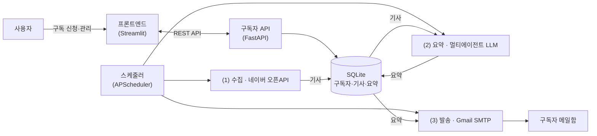

# 📨 개인 맞춤형 AI 뉴스레터(시스템 이름 결정 시 변경 예정)
> 강원대학교 2026 AI 부트캠프(여름 계절학기) 팀 프로젝트 · 5조

내가 고른 키워드의 뉴스만 AI가 요약해서, 정한 시간에 맞춰 메일로 발송하는 서비스입니다.

---

## 1. 주제 선정 이유

뉴스는 넘치는데 정작 내 관심사만 골라 읽을 시간이 없습니다. 포털을 열면 어떤 뉴스가 먼저 보일지, 흔한 뉴스레터가 무슨 주제를 다룰지 모두 내가 아니라 남이 정합니다.

그래서 **내가 고른 키워드만 · 내가 정한 시간에 · 3분이면 읽을 분량으로** 받아 보는 뉴스레터를 만들었습니다. 요약은 AI가 하되, 원문에 없는 내용을 지어내지 않도록 장치를 함께 뒀습니다.

## 2. 주요 기능

- **키워드 맞춤** — 관심 키워드, 받는 시간, 주기, 요약 길이, 언어는 취향에 맞게 선택할 수 있습니다.
- **AI 요약 (멀티에이전트)** — 요약 에이전트가 초안을 쓰고, 검수 에이전트가 원문과 대조해 틀린 곳을 고칩니다.
- **환각 막기** — 원문에 없는 숫자나 내용이 요약에 섞이지 않게 걸러냅니다. LLM에게 "지어내지 말라"고 지시하는 데서 그치지 않고, 코드가 직접 원문의 숫자·링크를 요약과 대조해 근거 없는 수치가 든 주제는 발송에서 빼고 원문에 없는 링크는 지웁니다.
- **중복 안 보내기** — 한 번 보낸 기사는 같은 사람에게 다시 보내지 않습니다. 링크가 같은 기사뿐 아니라, 링크가 달라도 제목과 기사 내용이 유사한 전재·재탕 기사까지 같은 기사로 간주하여 걸러냅니다.
- **주간 키워드** — 한 주에 한 번, 내가 구독한 키워드별로 그 주에 많이 다뤄진 주제와 관련 기사를 따로 모아 보냅니다.
- **이메일·본인 확인** — 가입할 때는 이메일을 확인하고, 정보를 조회하거나 수정하려면 본인 확인 코드를 입력하도록 했습니다. 이렇게 해서 관리자가 아닌 사람이 남의 정보를 함부로 들여다보거나 고치지 못하게 막습니다. 
- **관리자 화면** — 전체 구독자를 보고 수정·삭제하거나 간단한 통계를 확인합니다.

## 3. 아키텍처

수집·요약·발송을 한 번에 실행하지 않고, **SQLite를 사이에 둔 3단계 배치**로 분리했습니다. 수집·요약이 무거워도 발송이 늦어지지 않도록 단계를 나눴고, 각 단계의 결과는 DB를 거쳐 다음 단계로 넘어갑니다. 프론트엔드는 백엔드 REST API를 통해 구독자를 관리합니다.



- **(1) 수집** — 구독 키워드의 뉴스를 네이버 오픈API(검색)로 수집·정제하여 `articles`에 저장
- **(2) 요약** — (키워드·길이·언어) 조합별로 기사를 모아 **요약 에이전트 → 검수 에이전트**를 거쳐 이슈·주제 단위 요약을 생성하고 `digests`에 저장(환각·링크 무결성 검사 포함)
- **(3) 발송** — 발송 시간이 된 구독자에게 최신 요약을 렌더링해 메일로 발송하고, 발송한 기사를 기록하여 이후 동일 기사를 다시 발송하지 않음

**발송 신뢰성**
- **동일 대상 중복 발송 차단** — 발송 작업은 1분 주기로 실행됩니다. 이미 발송한 대상은 조건부 갱신 한 번으로 발송 여부를 확정하므로, 작업이 중첩 실행되더라도 동일한 메일이 중복 발송되지 않습니다.
- **새 기사가 없으면 발송 생략** — 요약은 30분 주기로 갱신되지만, 신선도는 요약 생성 시각이 아니라 요약에 포함된 기사의 최신 발행일을 기준으로 판정합니다. 새 기사가 없으면 그날 발송을 생략하여 이전 기사나 빈 메일이 반복 발송되지 않습니다.
- **개별 실패 격리** — 검수 에이전트가 실패하면 요약 초안으로 대체하며, 특정 구독자나 특정 (키워드·길이·언어) 조합에서 발생한 오류는 개별적으로 격리하여 같은 시간대의 다른 발송에 영향을 주지 않습니다. LLM 호출에는 30초 응답 제한 시간과 2회 재시도를 적용합니다.
- **다중 프로세스의 DB 공유** — 수집·요약·발송 스케줄러와 API 서버가 하나의 SQLite 파일을 공유합니다. 쓰기가 읽기를 막지 않게 하고, 짧게 접근이 겹칠 때는 곧바로 오류를 내는 대신 잠시 기다렸다 다시 시도하도록 설정해 잠금 충돌을 막습니다.

## 4. 시스템 환경 및 개발 툴

| 구분 | 기술 |
|---|---|
| 언어 | Python |
| 백엔드 | FastAPI · SQLite · APScheduler |
| 프론트엔드 | Streamlit |
| 뉴스 수집 | 네이버 오픈API (검색) |
| AI 요약 | OpenRouter (GPT-4o) |
| 메일 발송 | Gmail SMTP |

## 5. 프로젝트 구성 및 실행

| 폴더 | 내용 |
|---|---|
| `backend/` | 구독자 서버 · 발송 스케줄러 · AI 요약(`LLM_fn.py`) |
| `frontend/` | 구독 신청 · 관리 화면 |
| `Newsletter_template/` | 메일 디자인 · 기획 문서 |

```
backend/
├─ main.py            # 수집·요약·발송 스케줄러
├─ LLM_fn.py          # 요약·검수 에이전트 (LLM 파트)
└─ src/
   ├─ api.py          # 구독자 REST API
   ├─ pipeline.py     # 수집→요약→발송 흐름
   ├─ db.py           # SQLite 저장·조회
   ├─ subscriptions.py
   ├─ collectors/     # 네이버 뉴스 수집
   ├─ processors/     # 요약 처리
   ├─ notifiers/      # 메일 발송
   └─ renderers/      # 메일 HTML 렌더
```

프론트엔드가 백엔드 API를 호출하는 구조이므로, 두 서버를 각각 실행합니다.

```bash
# 백엔드
cd backend && pip install -r requirements.txt
cp .env.example .env      # NAVER_* / OPENAI_API_KEY / SENDER / GOOGLE_APP_PASSWORD / ADMIN_PASSWORD 채우기
uvicorn src.api:app --reload   # http://localhost:8000/docs
python main.py                 # 수집·요약·발송 (다른 터미널)

# 프론트엔드
cd frontend && pip install -r requirements.txt
cp .env.example .env
cp .streamlit/secrets.toml.example .streamlit/secrets.toml   # admin_password 채우기
streamlit run app.py           # http://localhost:8501
```

> 프론트엔드의 `admin_password` 값이 백엔드 `.env`의 `ADMIN_PASSWORD`와 일치해야 관리자 화면에 접근할 수 있습니다.

**환경변수**

| 변수 | 용도 | 필요 단계 |
|---|---|---|
| `NAVER_CLIENT_ID` · `NAVER_CLIENT_SECRET` | 네이버 검색 API (뉴스 수집) | 수집 |
| `OPENAI_API_KEY` | LLM 요약 키 (OpenRouter) | 요약 |
| `SENDER` · `GOOGLE_APP_PASSWORD` | Gmail 송신 계정·앱 비밀번호 | 발송 |
| `ADMIN_PASSWORD` | 관리자 화면 비밀번호 (미설정 시 관리자 기능 비활성화) | 관리자 |
| `API_BASE_URL` | 확인 메일 링크에 사용하는 백엔드 주소 (기본값 `localhost:8000`) | 배포 |
| `FRONTEND_BASE_URL` | 메일 하단 링크에 사용하는 프론트엔드 주소 (기본값 `localhost:8501`) | 배포 |
| `ACCESS_CODE_TTL_MINUTES` | 본인 확인 코드 유효 시간 (기본 15분) | 선택 |

**API 키 없이도 백엔드는 정상 동작합니다.** 구독 신청·조회·수정·삭제·통계, 본인 확인 코드 생성·검증까지 백엔드 로직은 SQLite만으로 동작합니다(관리자 기능은 `ADMIN_PASSWORD` 설정만 필요합니다). 확인 메일·인증 코드·뉴스레터를 이메일로 실제 발송하려면 Gmail 키가, 뉴스 수집·요약에는 네이버·OpenRouter 키가 필요합니다.

**API를 브라우저에서 바로 시험할 수 있습니다.** 백엔드를 실행한 뒤 http://localhost:8000/docs 에 접속하면 프론트엔드 없이도 모든 엔드포인트를 브라우저에서 직접 호출할 수 있습니다. 관리자 API는 우측 상단 `Authorize`에 관리자 비밀번호를 입력하여 인증합니다.

## 6. 팀원 역할

| 포지션 | 맡은 일 | 담당자 |
|---|---|---|
| LLM · Agent | 검색·요약·편집 멀티에이전트, 프롬프트 작성 | 변종민 (`jongmin-spec`) |
| 백엔드 | 뉴스 수집, 발송 파이프라인, 구독자 서버·DB | 최지민 (`jimmychoi46`) |
| 프론트엔드 | 구독·관리 화면, 백엔드 연동 | 조요한 (`Joyohan-20210530`) |
| 기획 · 데이터 | 메일 디자인, 요약 품질 기준, 프롬프트 인젝션 방어 | 김준한(`junhan333`) |

> AI 요약(`LLM_fn.py`)은 `backend/` 안에 있지만, LLM · Agent 담당이 맡은 별도 파트입니다.

## 7. 개발 일정

기간: **2026-07-07 ~ 07-14** (주말 제외)

| 날짜 | 한 일 |
|---|---|
| 7/7 (화) | 프로젝트 시작 · 백엔드 기초 틀 · 이메일 발송 모듈 |
| 7/8 (수) | 백엔드 개발 · LLM 요약 코드 · 프론트 백엔드 연동 · 유저 대시보드 |
| 7/9 (목) | 본인 확인 코드 인증 · 이메일 템플릿 · 프론트–백엔드–LLM 연동 준비 |
| 7/10 (금) | LLM 파트 통합(PR) · 주간 키워드·재발송 방지 기능 · 환각·요청 제한 점검 · backend·frontend dev 통합 |
| 7/13 (월) ||
| 7/14 (화) | 발표 준비 · 발표 |

## 8. 설계 시 중점을 둔 사항

기능 구현에 더해, 이러한 구조로 설계한 이유를 함께 정리한 부분입니다.

- **요약을 코드로 재검증** — LLM에 지시하는 데 그치지 않고, 원문의 숫자·링크를 요약과 코드로 대조합니다. 원문에 없는 수치가 포함된 주제는 발송에서 제외하고, 원문에 없는 링크는 제거합니다. 그래서 단순한 LLM 요약과는 다릅니다.
- **뉴스 본문을 명령이 아닌 데이터로 취급** — 요약 대상 기사에 "앞의 지시를 무시하라"와 같은 문장이 포함되어 있어도 이를 명령으로 실행하지 않도록, 모든 프롬프트에 보안 규칙을 삽입하고 본문의 HTML 태그를 제거합니다(프롬프트 인젝션 방어).
- **가입은 본인 확인 후 확정** — 확인 메일의 링크에 접속하면 안내 화면만 표시되고, '확인' 버튼을 눌러야 구독이 확정됩니다. 메일 미리보기가 링크를 자동으로 요청하더라도 구독이 확정되지 않으며, 확인에 사용하는 토큰은 1회 사용 후 폐기됩니다.
- **가입 여부 노출 차단과 안전한 기본값** — 본인 확인 코드를 요청하면 가입 여부와 관계없이 동일하게 응답하므로, 응답만으로는 가입 여부를 알 수 없습니다. 관리자·본인 인증 값은 비교하는 데 걸리는 시간만으로 값을 알아채지 못하게 대조하며, 관리자 비밀번호를 설정하지 않으면 관리자 기능은 아예 열리지 않습니다.
- **보이지 않는 문자 제거** — 이름·키워드·이메일에 화면에 드러나지 않는 제어·양방향·제로폭 문자가 섞여 들어와도 저장·정규화 단계에서 걸러냅니다. 이런 문자는 로그를 오염시키거나 글자의 표시 순서를 뒤집어(RTL 오버라이드, U+202E) 발신자나 본문을 실제와 다르게 보이도록 위장하는 데 악용될 수 있기 때문입니다.
- **요청 제한을 IP가 아닌 이메일 기준으로** — 프론트엔드가 백엔드를 서버 대 서버로 호출하는 구조라 모든 사용자가 동일한 IP로 인식됩니다. 따라서 가입·코드 발송을 IP가 아니라 대상 이메일별로 제한합니다(시간당 5회). IP 기준으로 제한하면 정상적인 가입까지 차단되고, 특정 대상에게 확인 메일을 대량 발송하는 것도 막을 수 없기 때문입니다.

## 9. 장단점 및 향후 계획 (TODO)

**장점**
- 관심 키워드, 받는 시간, 주기, 요약 길이, 언어까지 사용자별로 맞춤 설정
- 요약이 원문의 범위를 벗어나지 않으며, 동일 기사를 중복 수신하지 않음
- 주간 키워드로 한 주의 주요 흐름을 별도로 정리해 제공

**알려진 제약·가정**
- 현재는 단일 컴퓨터에서 SQLite로 단독 실행하는 것을 전제로 합니다.
- 발송 작업이 다소 지연되어도 해당 시각의 발송이 누락되지 않도록 여유 시간을 두었으나, 시스템 절전 등으로 1분 이상 중단되었다가 재개되면 해당 시각의 발송이 그날 누락될 수 있습니다.
- 공개 환경에 배포할 경우, 서버 대 서버 프론트엔드를 전제로 한 요청 제한을 IP 기준 등으로 보강해야 합니다.
- 근접 중복 판정은 글자 단위 유사도를 기준으로 하므로, 임계값에 따라 일부를 누락하거나 서로 다른 기사를 과도하게 하나로 묶을 수 있습니다.

**미흡한 점 · 향후 개선 방향**
- 속보 알림 — 정해진 발송 시간 외에도 중요한 뉴스가 발생하면 즉시 알리는 기능
- 발송 요일이 고정되어 있음 → 발송 요일 선택 화면 추가
- 주간 키워드를 글자 단위로 집계하는 방식 → 의미가 유사한 주제를 묶는 방식(클러스터링) 도입
- 내용 환각(사실이 아닌 서술)은 아직 완전히 차단하지 못함 → 검증 단계 보강
- 현재는 개별 컴퓨터에서 실행 → 외부 서버 배포
